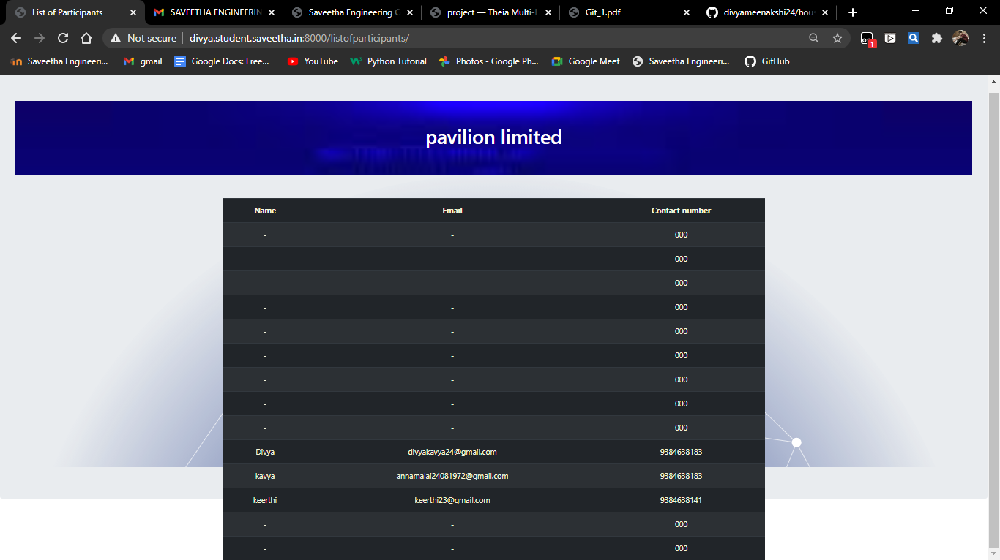

# WebApplication for Event Registration

## AIM:
To create a UX design and develop a web application for event registration.
## DESIGN STEPS:
Step 1:
Requirement collection.

Step 2:
Choosing the suitable color scheme

Step 3:
Creating artboards for individual pages

Step 4:
Designing layout for individual pages

Step 5:
Creating links and linking it with artboards

Step 6:
Preview the prototype.


## DESIGN SCREENS:


## PROTOTYPE:


## PROGRAM:

### home.html
```
<!doctype html>
<html lang="en">
  <head>
    <!-- Required meta tags -->
    <meta charset="utf-8">
    <meta name="viewport" content="width=device-width, initial-scale=1, shrink-to-fit=no">

    <!-- Bootstrap CSS -->
    <link rel="stylesheet" href="https://maxcdn.bootstrapcdn.com/bootstrap/4.0.0/css/bootstrap.min.css" integrity="sha384-Gn5384xqQ1aoWXA+058RXPxPg6fy4IWvTNh0E263XmFcJlSAwiGgFAW/dAiS6JXm" crossorigin="anonymous">

    <title>Pavillion 2021</title>
  </head>
  <body>
    <div class="jumbotron">
        <div class="container">
  <h1 class="display-4">WELCOME TO PAVILLION 2021</h1>
  <p class="lead"> Hope you are doing good! </p>
  <hr class="my-4">
  <p> We are happy to invite you to our culturals<br>
      To have more fun, <br>
      DO REGISTER!!
  </p>
 
</div>
    </div>
    <div class="container">
        <div class="row">
            <div class="col-12">
                <h1> Click here to register</h1>

            </div>
        </div>
    </div>
    <div class="container">
        <div class="row">
            <div class="col-12">
                <a href="/registration" class="btn btn-primary btn-lg active" role="button" aria-pressed="true">Register</a>
            </div>
        </div>
    </div>


    

    <!-- Optional JavaScript -->
    <!-- jQuery first, then Popper.js, then Bootstrap JS -->
    <script src="https://code.jquery.com/jquery-3.2.1.slim.min.js" integrity="sha384-KJ3o2DKtIkvYIK3UENzmM7KCkRr/rE9/Qpg6aAZGJwFDMVNA/GpGFF93hXpG5KkN" crossorigin="anonymous"></script>
    <script src="https://cdnjs.cloudflare.com/ajax/libs/popper.js/1.12.9/umd/popper.min.js" integrity="sha384-ApNbgh9B+Y1QKtv3Rn7W3mgPxhU9K/ScQsAP7hUibX39j7fakFPskvXusvfa0b4Q" crossorigin="anonymous"></script>
    <script src="https://maxcdn.bootstrapcdn.com/bootstrap/4.0.0/js/bootstrap.min.js" integrity="sha384-JZR6Spejh4U02d8jOt6vLEHfe/JQGiRRSQQxSfFWpi1MquVdAyjUar5+76PVCmYl" crossorigin="anonymous"></script>
  </body>
</html>
```
### registration.html
```
<!doctype html>
<html lang="en">

<head>
    <!-- Required meta tags -->
    <meta charset="utf-8">
    <meta name="viewport" content="width=device-width, initial-scale=1, shrink-to-fit=no">

    <!-- Bootstrap CSS -->
    <link rel="stylesheet" href="https://maxcdn.bootstrapcdn.com/bootstrap/4.0.0/css/bootstrap.min.css"
        integrity="sha384-Gn5384xqQ1aoWXA+058RXPxPg6fy4IWvTNh0E263XmFcJlSAwiGgFAW/dAiS6JXm" crossorigin="anonymous">

    <title>Saveetha Engineering College</title>
</head>

<body>
    <div class="jumbotron">
        <div class="container">
            <h1 class="display-4">Hello, Guys!</h1>
            <p class="lead">Welcome to our cultural program</p>
        </div>
    </div>
    <div class="container">
        <div class="row">
            <div class="col-12">
                <h1>Application</h1>
                <form method="POST" action="/registration/" >
                    


                    <div class="form-group">
                        <label for="exampleInputEmail1">NAME:</label>
                        <input type="name" class="form-control" id="name" aria-describedby="emailHelp"
                            placeholder="Enter name">
                        <small id="emailHelp" class="form-text text-muted">We'll never share your details with anyone
                            else.</small>
                    </div>
                    <div class="form-group">
                        <label for="exampleInputPassword1">EMAIL:</label>
                        <input type="email" class="form-control" id="exampleInputPassword1" placeholder="Email">
                    </div>
                    <div class="form-group">
                        <label for="exampleInputPassword1">PHONE NO. :</label>
                        <input type="number" class="form-control" id="exampleInputPassword1" placeholder="Phone number">
                    </div>

                    <button type="submit" class="btn btn-primary">Submit</button>
                </form>


                <!-- Optional JavaScript -->
                <!-- jQuery first, then Popper.js, then Bootstrap JS -->
                <script src="https://code.jquery.com/jquery-3.2.1.slim.min.js"
                    integrity="sha384-KJ3o2DKtIkvYIK3UENzmM7KCkRr/rE9/Qpg6aAZGJwFDMVNA/GpGFF93hXpG5KkN"
                    crossorigin="anonymous"></script>
                <script src="https://cdnjs.cloudflare.com/ajax/libs/popper.js/1.12.9/umd/popper.min.js"
                    integrity="sha384-ApNbgh9B+Y1QKtv3Rn7W3mgPxhU9K/ScQsAP7hUibX39j7fakFPskvXusvfa0b4Q"
                    crossorigin="anonymous"></script>
                <script src="https://maxcdn.bootstrapcdn.com/bootstrap/4.0.0/js/bootstrap.min.js"
                    integrity="sha384-JZR6Spejh4U02d8jOt6vLEHfe/JQGiRRSQQxSfFWpi1MquVdAyjUar5+76PVCmYl"
                    crossorigin="anonymous"></script>
</body>

</html
```
### success.html
```
<!doctype html>
<html lang="en">
  <head>
    <!-- Required meta tags -->
    <meta charset="utf-8">
    <meta name="viewport" content="width=device-width, initial-scale=1, shrink-to-fit=no">

    <!-- Bootstrap CSS -->
    <link rel="stylesheet" href="https://maxcdn.bootstrapcdn.com/bootstrap/4.0.0/css/bootstrap.min.css" integrity="sha384-Gn5384xqQ1aoWXA+058RXPxPg6fy4IWvTNh0E263XmFcJlSAwiGgFAW/dAiS6JXm" crossorigin="anonymous">

    <title>YAAY!</title>
  </head>
  <body>
    <h1>CONGRATSS!! YOU APPLICATION HAS BEEN ACCEPTED!!</h1>
    <h2>now you are also a part of pavillion
    </h2>
    <a href="/home/" class="btn btn-primary btn-lg active" role="button" aria-pressed="true">Home</a>
    <!-- Optional JavaScript -->
    <!-- jQuery first, then Popper.js, then Bootstrap JS -->
    <script src="https://code.jquery.com/jquery-3.2.1.slim.min.js" integrity="sha384-KJ3o2DKtIkvYIK3UENzmM7KCkRr/rE9/Qpg6aAZGJwFDMVNA/GpGFF93hXpG5KkN" crossorigin="anonymous"></script>
    <script src="https://cdnjs.cloudflare.com/ajax/libs/popper.js/1.12.9/umd/popper.min.js" integrity="sha384-ApNbgh9B+Y1QKtv3Rn7W3mgPxhU9K/ScQsAP7hUibX39j7fakFPskvXusvfa0b4Q" crossorigin="anonymous"></script>
    <script src="https://maxcdn.bootstrapcdn.com/bootstrap/4.0.0/js/bootstrap.min.js" integrity="sha384-JZR6Spejh4U02d8jOt6vLEHfe/JQGiRRSQQxSfFWpi1MquVdAyjUar5+76PVCmYl" crossorigin="anonymous"></script>
  </body>
</html>
```
### failed.html
```
<!doctype html>
<html lang="en">
  <head>
    <!-- Required meta tags -->
    <meta charset="utf-8">
    <meta name="viewport" content="width=device-width, initial-scale=1, shrink-to-fit=no">

    <!-- Bootstrap CSS -->
    <link rel="stylesheet" href="https://maxcdn.bootstrapcdn.com/bootstrap/4.0.0/css/bootstrap.min.css" integrity="sha384-Gn5384xqQ1aoWXA+058RXPxPg6fy4IWvTNh0E263XmFcJlSAwiGgFAW/dAiS6JXm" crossorigin="anonymous">

    <title>SORRY :(</title>
  </head>
  <body>
    <h1> THE SEATS ARE FILLED!!</h1>
    <h2> thank you for participating...
    </h2>

    <!-- Optional JavaScript -->
    <!-- jQuery first, then Popper.js, then Bootstrap JS -->
    <script src="https://code.jquery.com/jquery-3.2.1.slim.min.js" integrity="sha384-KJ3o2DKtIkvYIK3UENzmM7KCkRr/rE9/Qpg6aAZGJwFDMVNA/GpGFF93hXpG5KkN" crossorigin="anonymous"></script>
    <script src="https://cdnjs.cloudflare.com/ajax/libs/popper.js/1.12.9/umd/popper.min.js" integrity="sha384-ApNbgh9B+Y1QKtv3Rn7W3mgPxhU9K/ScQsAP7hUibX39j7fakFPskvXusvfa0b4Q" crossorigin="anonymous"></script>
    <script src="https://maxcdn.bootstrapcdn.com/bootstrap/4.0.0/js/bootstrap.min.js" integrity="sha384-JZR6Spejh4U02d8jOt6vLEHfe/JQGiRRSQQxSfFWpi1MquVdAyjUar5+76PVCmYl" crossorigin="anonymous"></script>
  </body>
</html>
```
### listofparticipants.html
```
<!doctype html>
<html lang="en">

<head>
    <!-- Required meta tags -->
    <meta charset="utf-8">
    <meta name="viewport" content="width=device-width, initial-scale=1, shrink-to-fit=no">

    <!-- Bootstrap CSS -->
    <link rel="stylesheet" href="https://maxcdn.bootstrapcdn.com/bootstrap/4.0.0/css/bootstrap.min.css"
        integrity="sha384-Gn5384xqQ1aoWXA+058RXPxPg6fy4IWvTNh0E263XmFcJlSAwiGgFAW/dAiS6JXm" crossorigin="anonymous">

    <title>List of Participants</title>
</head>

<body>
    <div class="jumbotron" style="box-sizing: border-box;">
      <div class="p-5 text-center bg-image" style="
      background-image: url('https://encrypted-tbn0.gstatic.com/images?q=tbn:ANd9GcTK-3iM5cARVJ1SFV_PSQT_nBgShVZIBMtyCw&usqp=CAU');
      height: 200%;background-repeat: no-repeat;background-size: cover;">
        <div class="container">
        <h1 class="display-8 text-center" style=color:white font-style=helvetica>pavilion limited</h1>
        </div>
    </div>
    <div class="p-5 text-center bg-image" style="
      background-image: url('https://hlassets.paessler.com/common/files/background-photos/iot-world.svg');
      height: 600px;background-repeat: no-repeat;background-size: cover;">
    <div class="container" style=color:beige>
        <table class="table  table-striped table-dark" style=color:beige>
            <thead>
                <tr>
                    <th scope="col">Name</th>
                    <th scope="col">Email</th>
                    <th scope="col">Contact number</th>

                </tr>
            </thead>
            <tbody>
                

                <tr >
                    <td>{{col.username}}</td>
                    <td>{{col.email}}</td>
                    <td>{{col.phone}}</td>

                </tr>
                


                </tbody>
        </table> -0v
    </div>

    <!-- Optional JavaScript -->
    <!-- jQuery first, then Popper.js, then Bootstrap JS -->
    <script src="https://code.jquery.com/jquery-3.2.1.slim.min.js"
        integrity="sha384-KJ3o2DKtIkvYIK3UENzmM7KCkRr/rE9/Qpg6aAZGJwFDMVNA/GpGFF93hXpG5KkN"
        crossorigin="anonymous"></script>
    <script src="https://cdnjs.cloudflare.com/ajax/libs/popper.js/1.12.9/umd/popper.min.js"
        integrity="sha384-ApNbgh9B+Y1QKtv3Rn7W3mgPxhU9K/ScQsAP7hUibX39j7fakFPskvXusvfa0b4Q"
        crossorigin="anonymous"></script>
    <script src="https://maxcdn.bootstrapcdn.com/bootstrap/4.0.0/js/bootstrap.min.js"
        integrity="sha384-JZR6Spejh4U02d8jOt6vLEHfe/JQGiRRSQQxSfFWpi1MquVdAyjUar5+76PVCmYl"
        crossorigin="anonymous"></script>
</body>

</html>
```


## OUTPUT:




## RESULT:
Thus, a UX design is created and a web application is developed for event registration in the url http://divya.student.saveetha.in:8000/home/.